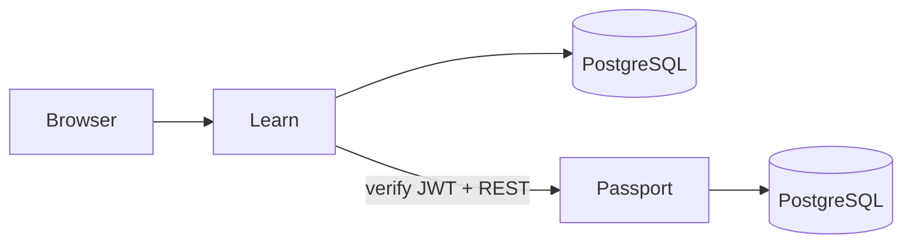

# Learn — Online Course Platform

Teach and learn with structured courses: ordered **markdown**, **image**, and **video** items, category catalog, enrollment with teacher approval, and progress tracking.

Product name **Learn** (repo/Maven/Docker remain `cursos`). Quarkus REST API + Angular SPA (Quinoa), authenticated via **Passport** JWT. White-label branding via `learn.brand.*` / `GET /api/branding`. Production host: [https://learn.vepo.dev](https://learn.vepo.dev).

## Tech stack

| Layer | Technology |
|-------|------------|
| Backend | Quarkus 3, Java 21, JAX-RS, CDI, Hibernate ORM |
| Frontend | Angular 20, Angular Material |
| Integration | Quarkus Quinoa (SPA dev server + production bundle) |
| Database | PostgreSQL, Flyway |
| Auth | Passport JWT (RS256) — SmallRye JWT validation |
| Email | Quarkus Mailer + Qute templates (enrollment notifications) |
| Tests | JUnit 5, REST Assured, ArchUnit; Karma/Jasmine (frontend) |
| Build | Maven |
| Image | `vepo/cursos:main` (JVM) |

## Architecture

Learn is a modular monolith: one Quarkus process serves the REST API and the Angular SPA. Identity lives in **Passport**; Learn validates Passport-issued JWTs and calls Passport for login and profile updates. Course media (images/video) is stored in PostgreSQL and served via short-lived signed URLs.



| Runtime | Dev port | Role |
|---------|----------|------|
| Passport | 8080 | Login, users, JWT signing |
| Learn (cursos) | 8083 | API + SPA (Quinoa → Angular on 4203) |
| Learn tests | 8084 | Quarkus test HTTP port |

Full package map and API surface: [ARCHITECTURE.md](ARCHITECTURE.md).

## Quick start

One command (starts Passport if not already running, then Learn):

```bash
./scripts/dev.sh
```

Or manually — start **Passport** first (identity), then **Learn**:

```bash
# Terminal 1 — Passport (8080)
cd ../passport && mvn quarkus:dev

# Terminal 2 — Learn / cursos (8083)
cd ../cursos && mvn quarkus:dev
```

- Learn UI + API: [http://localhost:8083](http://localhost:8083) (Quinoa forwards to the Angular dev server on 4203)
- Passport login API: [http://localhost:8080/api/auth/login](http://localhost:8080/api/auth/login)
- OpenAPI / Swagger UI: [http://localhost:8083/openapi](http://localhost:8083/openapi)
- Branding API: [http://localhost:8083/api/branding](http://localhost:8083/api/branding)
- Health: [http://localhost:8083/q/health](http://localhost:8083/q/health)

Dev mode runs Flyway clean+migrate (`%dev.quarkus.flyway.clean-at-start=true`) and loads sample data from `dev-import.sql`.

### Dev login

Use Passport dev seed credentials (same password for all: `qwas1234`):

| User | Email | Notes |
|------|-------|-------|
| `cto-boss` | `cto@passport.vepo.dev` | Teacher + `cursos.admin`; Quarkus/PostgreSQL; certificate on Angular |
| `junior` | `junior_dev@passport.vepo.dev` | Teaches Angular; student mid-progress on Quarkus |
| `alice` / `bob` / `carol` / `diego` | `*@passport.vepo.dev` | Extra students (partial / concluded / pending / rejected) |
| `mentor` | `mentor@passport.vepo.dev` | Second teacher (DevOps) |
| `guest-user` | `guest@passport.vepo.dev` | Pending enrollment on Quarkus |

Log in through the Learn UI. Open the top-right menu icon for **Aprender**, **Ensinar**, and role-gated **Admin**. Full persona table: [docs/feature-catalog.md](docs/feature-catalog.md) § Dev personas.

## Project layout

```
cursos/
├── src/main/java/dev/vepo/cursos/   # Quarkus packages (auth, course, enrollment, …)
├── src/main/resources/
│   ├── application.properties
│   ├── db/migration/               # Flyway baseline
│   └── dev-import.sql              # %dev seed
├── src/main/webui/                 # Angular 20 SPA (Quinoa)
├── src/main/docker/Dockerfile      # JVM image for vepo/cursos
├── src/test/java/                  # Quarkus / REST Assured / ArchUnit
├── docs/                           # Domain, catalog, deploy, config
├── feature/                        # Feature analysis and task approval
├── scripts/dev.sh                  # Local Passport + Learn
└── ARCHITECTURE.md
```

## Features

### Catalog & courses

- **Catalog home** — **Ensinando**, **Matriculado**, and **Disponível / Solicitado** (taught courses stay out of Available)
- **Visual shell** — Learn light palette (ink header, teal accent) with sticky header/footer, contextual sidebars, and account/logout in the menu drawer; white-label via branding API
- **Navigation drawer** — top-right, click-only access to **Aprender**, **Ensinar**, **Conta**, and role-gated **Admin**
- **Minha conta** — edit name/email/author description and change password via Passport
- **Course media** — optional cover images, gallery assets embedded in Markdown via signed URLs, and video playback tickets
- **Categories** — classify courses; create requires `cursos.admin`
- **Course** — title, description, categories; creator is the **teacher**; clear **Publicar curso** / **Despublicar**
- **Course items / aulas** — ordered **MARKDOWN**, **LINK**, **IMAGE**, **VIDEO** (video in PostgreSQL `BYTEA` with signed Range playback); two-pane editor with unsaved-changes warnings

### Study & discussion

- **Course summary** — **Sobre o curso** and live **Sobre o autor** panels on the study page
- **Sequential unlock** — first aula open; later aulas unlock only after previous ones are completed (teacher preview bypasses)
- **Progress bar** — study sidebar shows completed/total and percentage
- **Rollback** — **Desfazer progresso** clears the selected aula and all later aulas
- **Course completion** — finish screen at 100%; authenticated PDF certificate download; catalog **Concluído** badge
- **Rendered markdown** — sanitized HTML with heading sizes below the aula title; raw markdown only when editing
- **Link aulas** — safe **Abrir recurso** (`target="_blank"`, `rel="noopener noreferrer"`)
- **Video aulas** — authenticated playback tickets and seekable HTTP Range streaming
- **Comments** — enrolled students and teacher discuss accessible aulas (**Comentar**)
- **Upvotes** — positive-only, one per user/comment (toggle)
- **Moderation** — teacher can hide/restore comments; students never see hidden ones

### Enrollment & progress

- **Enrollment request** — student self-enrolls → **REQUESTED** until teacher approves
- **Direct enrollment** — teacher adds a student by email; optional notification email
- **Progress** — students mark aulas complete or roll back; teachers can adjust; percentage from completed items; `concluded_at` when 100%
- **Certificate** — enrolled students download a server-generated PDF after course conclusion

### Post-MVP (designed)

- **Git course sync** — `course.yml` in a repository syncs content into course items ([feature/git-course-sync.md](feature/git-course-sync.md))

## Build & test

```bash
# Backend + formatter + unit/integration tests (CI gate)
mvn verify

# After backend API / OpenAPI changes — regenerate Angular clients
mvn test
cd src/main/webui && npm run generate:api

# Frontend (when webui changed)
cd src/main/webui && npm run build
cd src/main/webui && npm test -- --no-watch --browsers=ChromeHeadless
```

Generated TypeScript clients land in `src/main/webui/src/app/generated/` (gitignored). Angular facades in `services/` wrap the generated `*Api` classes.

## Deploy & configure

| Guide | Purpose |
|-------|---------|
| [docs/deployment.md](docs/deployment.md) | Package, Docker image, runtime dependencies, production smoke checks |
| [docs/configuration.md](docs/configuration.md) | Environment variables and `application.properties` reference |

Platform production (`learn.vepo.dev`, nginx, compose) is documented in the **backoffice-prod** MoP — see the deployment guide for the link.

## Documentation

| Document | Purpose |
|----------|---------|
| [AGENTS.md](AGENTS.md) | Agent entry point |
| [ARCHITECTURE.md](ARCHITECTURE.md) | Technical architecture |
| [docs/deployment.md](docs/deployment.md) | How to package and deploy |
| [docs/configuration.md](docs/configuration.md) | Configuration and environment variables |
| [docs/domain-specification.md](docs/domain-specification.md) | Domain language and invariants |
| [docs/feature-catalog.md](docs/feature-catalog.md) | UI routes and flows |
| [docs/ui-elements-gallery.md](docs/ui-elements-gallery.md) | UI patterns and shell classes |
| [docs/backlog.md](docs/backlog.md) | Product backlog |
| [feature/](feature/) | Feature specs and task approval |
