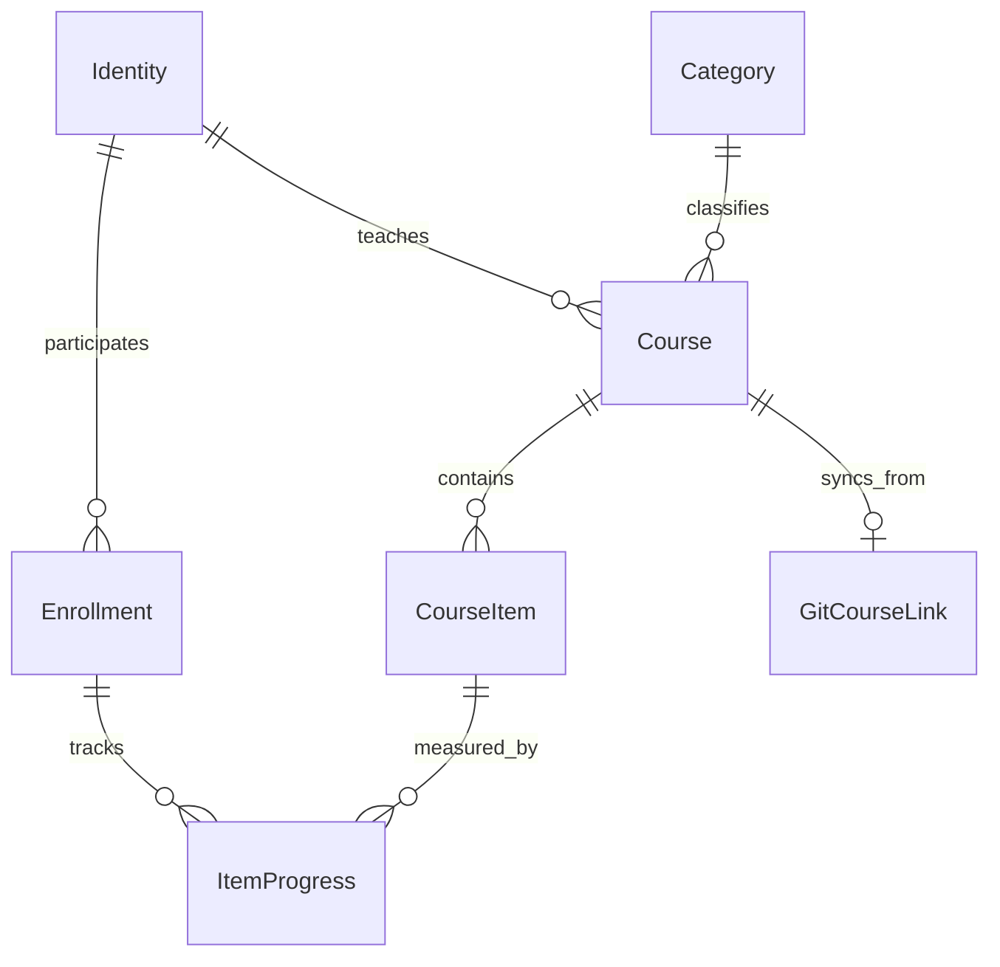
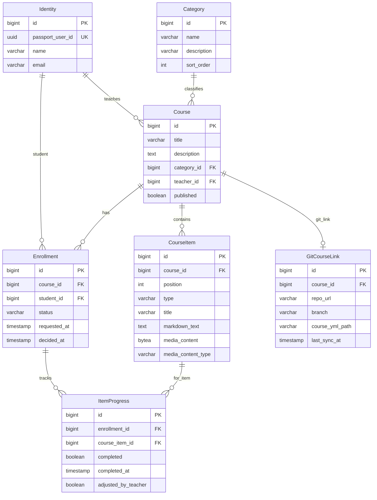

# Cursos — Domain Specification

Canonical domain language for **Cursos**, an online course platform. Developers, reviewers, and AI agents must align code, tests, and UI copy with this document.

**Related references:** [ARCHITECTURE.md](../ARCHITECTURE.md) (technical patterns), [feature-catalog.md](feature-catalog.md) (routes and UI flows).

**Maintenance:** When a change introduces or alters domain concepts, UI labels, or business rules, update this file **before** merging (see [.cursor/rules/domain-model.mdc](../.cursor/rules/domain-model.mdc)).

---

## Context

Cursos lets **teachers** create **courses** with ordered **course items** (markdown, image, video). **Students** discover courses in the **catalog**, **request enrollment**, and track **progress** as they complete items. **Categories** organize the catalog. Identity and login live in **Passport**; Cursos stores a local **identity** mirror keyed by Passport user id.

---

## Bounded contexts

Cursos is a **modular monolith**: one deployable, feature packages under `dev.vepo.cursos.*`. Contexts communicate via service calls at documented boundaries — not by reaching into another context's repositories from unrelated endpoints.

| Context | Packages | May depend on |
|---------|----------|---------------|
| **Platform** | `infra` | JDK/Jakarta only |
| **Identity & access** | `auth`, `identity` | platform |
| **Catalog** | `catalog` | platform, identity, course, enrollment |
| **Course** | `course` (incl. `course.category`, `course.item`) | platform, identity |
| **Enrollment** | `enrollment` | platform, identity, course, mailer |
| **Progress** | `progress` | platform, identity, course, enrollment |
| **Email** | `mailer` | platform, identity |
| **Git course sync** | `git` | platform, identity, course — **post-MVP** |

**Rules:**

- Feature packages must not depend on unrelated contexts (e.g. `catalog` must not depend on `git` during MVP).
- Cross-context workflows (approve enrollment → email) use services in the owning context or injected `MailerService`.
- `infra` holds exception mappers, SPA routing, and dev setup — no domain logic.
- **Passport** is external — not a bounded context of the monolith.

---

## Ubiquitous Language

Terms below are the **only** approved names for aggregates, entities, states, actions, and user-visible labels unless this document is updated first.

### Platform & identity

| Term | Meaning | Code / notes |
|------|---------|--------------|
| **Cursos** | The product (online course platform). | UI title |
| **Passport** | External identity service issuing JWT. | Login at `:8080`; not part of Cursos codebase |
| **Identity** | Local mirror of a Passport user (id, name, email). | `Identity`, `tb_identities`; keyed by `passport_user_id` |
| **Teacher** | User who **created** a course — not a global role. | `Course.teacherId`; UI **Professor** / section **Ensinando** |
| **Student** | User with an **enrollment** on a course. | `Enrollment.studentId`; UI **Aluno** / section **Matriculado** |
| **Session** | Authenticated state via Passport JWT Bearer token. | Angular `auth.interceptor.ts` |

### Catalog

| Term | Meaning | Code / notes |
|------|---------|--------------|
| **Catalog home** | Landing page with three course sections. | Route `/`; UI **Início** |
| **Ensinando** | Catalog section: courses the current user **teaches**. | `GET /catalog/teaching` |
| **Matriculado** | Catalog section: courses where enrollment status is **ENROLLED**. | `GET /catalog/enrolled` |
| **Disponível / Solicitado** | Catalog section: published courses available to request, plus courses with **REQUESTED** enrollment by current user. | `GET /catalog/available`; UI **Disponível / Solicitado** |
| **Category** | Label grouping courses (e.g. Programming, Design). | `Category`, `tb_categories`; UI **Categoria** |

### Course & content

| Term | Meaning | Code / notes |
|------|---------|--------------|
| **Course** | A teachable unit: title, description, category, teacher, published flag. | `Course`, `tb_courses` |
| **Published course** | Course visible in **Disponível / Solicitado** for enrollment requests. | `Course.published = true` |
| **Course item** | Single ordered piece of course content. | `CourseItem`, `tb_course_items` |
| **Item order** | Zero-based position determining display sequence. | `CourseItem.position` |
| **Markdown item** | Course item type storing rich text in `markdown_text`. | `CourseItemType.MARKDOWN` |
| **Image item** | Course item type storing binary image in `media_content`. | `CourseItemType.IMAGE` |
| **Video item** | Course item type storing binary video in `media_content`. | `CourseItemType.VIDEO` |
| **Reorder items** | Teacher action changing item sequence. | `POST …/items/reorder` |

### Enrollment

| Term | Meaning | Code / notes |
|------|---------|--------------|
| **Enrollment** | Relationship linking a **student** to a **course**. | `Enrollment`, `tb_enrollments` |
| **Request enrollment** | Student self-service action creating **REQUESTED** enrollment. | UI **Solicitar matrícula** |
| **Approve enrollment** | Teacher accepts **REQUESTED** → **ENROLLED**. | UI **Aprovar** |
| **Reject enrollment** | Teacher declines **REQUESTED** → **REJECTED**. | UI **Recusar** |
| **Direct enrollment** | Teacher enrolls a student by email without request step. | UI **Matricular aluno**; creates **ENROLLED** immediately |
| **REQUESTED** | Enrollment awaiting teacher decision. | `EnrollmentStatus.REQUESTED` |
| **ENROLLED** | Active student — may view items and track progress. | `EnrollmentStatus.ENROLLED` |
| **REJECTED** | Declined enrollment request. | `EnrollmentStatus.REJECTED` |

### Progress

| Term | Meaning | Code / notes |
|------|---------|--------------|
| **Item progress** | Per-enrollment completion state for one course item. | `ItemProgress`, `tb_item_progress` |
| **Mark complete** | Student toggles item as completed. | UI checkbox / **Concluir** |
| **Teacher adjust** | Teacher overrides student item completion. | `adjusted_by_teacher = true` |
| **Progress percentage** | `completedItems / totalItems * 100` rounded. | Shown on course card and study view |

### Email

| Term | Meaning | Code / notes |
|------|---------|--------------|
| **Enrollment notification** | Email sent on direct enroll or approval. | `MailerService`; Qute templates |

### Git course sync (post-MVP)

| Term | Meaning | Code / notes |
|------|---------|--------------|
| **Git course link** | Association between course and Git repo + `course.yml` path. | `GitCourseLink`, `tb_git_course_links` |
| **course.yml** | YAML manifest listing ordered items to sync. | [feature/git-course-sync.md](../feature/git-course-sync.md) |
| **Sync course** | Import/update course items from `course.yml`. | `GitCourseSyncService` — **post-MVP** |

---

## Invariants

### Identity

1. Every authenticated action resolves the current user from JWT `sub` and upserts a local **Identity** row.
2. Cursos never stores Passport passwords.

### Course

1. A **Course** has exactly one **teacher** — the identity who created it; ownership does not transfer in MVP.
2. Only the **teacher** may edit course metadata, items, publish/unpublish, and manage enrollments.
3. A course must have a **category** before publish (MVP).
4. **Course items** have unique `position` values per course; reorder maintains contiguous ordering.

### Course items

1. **MARKDOWN** items must have non-empty `markdown_text`; `media_content` is null.
2. **IMAGE** and **VIDEO** items must have non-null `media_content` and `media_content_type`.
3. Enrolled students and the teacher may **read** items; only the teacher may **mutate** items.

### Enrollment

1. At most one enrollment row per `(course_id, student_id)` pair.
2. A **student** cannot **request enrollment** if already **ENROLLED** or **REQUESTED**.
3. Only **published** courses appear in **Disponível / Solicitado** for new requests.
4. **Direct enrollment** creates **ENROLLED** immediately; sends notification email when address resolves to an identity.
5. **Approve** transitions **REQUESTED → ENROLLED**; **Reject** transitions **REQUESTED → REJECTED**.

### Progress

1. **Item progress** exists only for **ENROLLED** students.
2. **Mark complete** is allowed for the enrolled student on their own enrollment.
3. **Teacher adjust** is allowed only for the course teacher on enrollments for that course.
4. **Progress percentage** uses all course items as denominator; items without progress rows count as incomplete.

### Catalog

1. **Ensinando** lists courses where `teacher_id = current user`.
2. **Matriculado** lists courses with **ENROLLED** enrollment for current user.
3. **Disponível / Solicitado** lists published courses not taught by current user, excluding **ENROLLED**; includes **REQUESTED** with badge.

### Git sync (post-MVP)

1. Sync never deletes enrollments or progress — item mapping uses stable keys from `course.yml`.
2. Implement only after MVP platform is **done**.

---

## Entity relationship diagram

---

## UI labels (pt-BR)

| Domain term | UI label |
|-------------|----------|
| Catalog home | Início |
| Ensinando | Ensinando |
| Matriculado | Matriculado |
| Disponível / Solicitado | Disponível / Solicitado |
| Category | Categoria |
| Course | Curso |
| Course item | Conteúdo |
| Request enrollment | Solicitar matrícula |
| Approve | Aprovar |
| Reject | Recusar |
| Direct enroll | Matricular aluno |
| Progress | Progresso |
| Mark complete | Marcar como concluído |

English UI (if added later) must map to the same domain terms in code.
