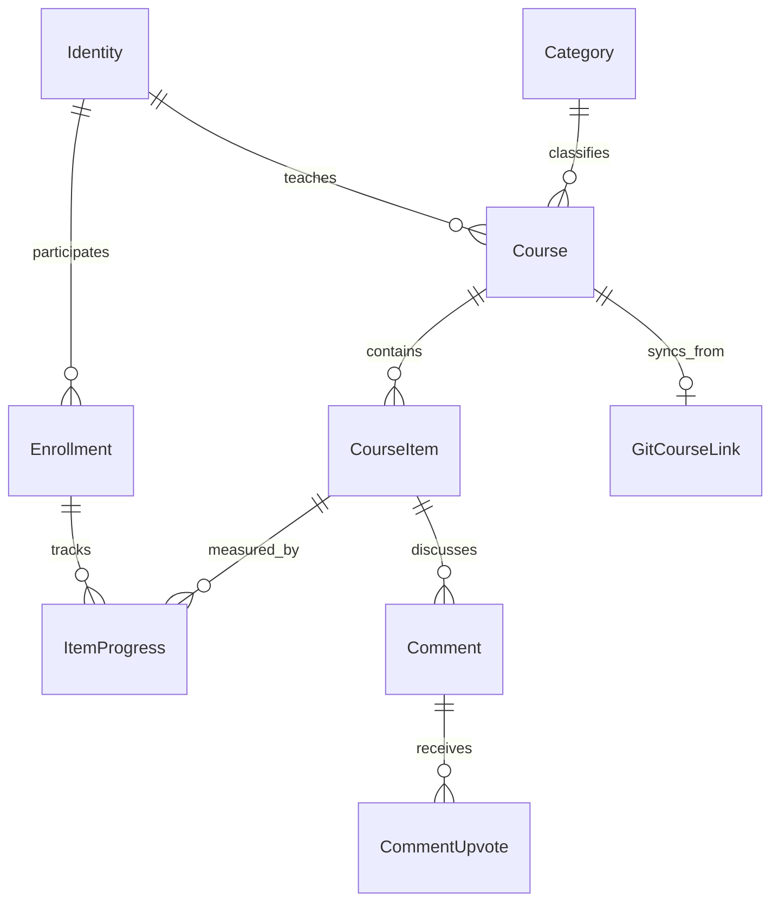
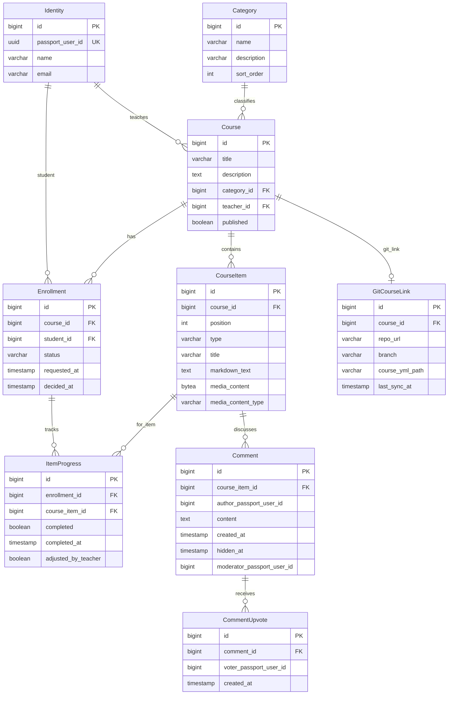

# Cursos — Domain Specification

Canonical domain language for **Cursos**, an online course platform. Developers, reviewers, and AI agents must align code, tests, and UI copy with this document.

**Related references:** [ARCHITECTURE.md](../ARCHITECTURE.md) (technical patterns), [feature-catalog.md](feature-catalog.md) (routes and UI flows).

**Maintenance:** When a change introduces or alters domain concepts, UI labels, or business rules, update this file **before** merging (see [.cursor/rules/domain-model.mdc](../.cursor/rules/domain-model.mdc)).

---

## Context

Cursos lets **teachers** create **courses** with ordered **course items** (markdown, image, video). **Students** discover courses in the **catalog**, **request enrollment**, and track **progress** as they complete items. **Categories** organize the catalog. Identity and login live in **Passport**; Cursos stores a local **identity** mirror keyed by Passport user id.

---

## Bounded contexts

Cursos is a **modular monolith**: one deployable, feature packages under `dev.vepo.cursos.*`. Contexts communicate via service calls at documented boundaries — not by reaching into another context's repositories from unrelated endpoints.

| Context | Packages | May depend on |
|---------|----------|---------------|
| **Platform** | `infra` | JDK/Jakarta only |
| **Identity & access** | `auth`, `identity` | platform |
| **Catalog** | `catalog` | platform, identity, course, enrollment, progress |
| **Course** | `course` (incl. `course.category`, `course.item`) | platform, identity |
| **Enrollment** | `enrollment` | platform, identity, course, mailer |
| **Progress** | `progress` | platform, identity, course, enrollment, study |
| **Study** | `study` | platform, identity, course, enrollment, progress |
| **Discussion** | `discussion` | platform, identity, course, enrollment, study |
| **Email** | `mailer` | platform, identity |
| **Git course sync** | `git` | platform, identity, course — **post-MVP** |

**Rules:**

- Feature packages must not depend on unrelated contexts (e.g. `catalog` must not depend on `git` during MVP).
- Cross-context workflows (approve enrollment → email) use services in the owning context or injected `MailerService`.
- `infra` holds exception mappers, SPA routing, and dev setup — no domain logic.
- **Passport** is external — not a bounded context of the monolith.

---

## Ubiquitous Language

Terms below are the **only** approved names for aggregates, entities, states, actions, and user-visible labels unless this document is updated first.

### Platform & identity

| Term | Meaning | Code / notes |
|------|---------|--------------|
| **Cursos** | The product (online course platform). | UI title |
| **Passport** | External identity service issuing JWT. | Login at `:8080`; not part of Cursos codebase |
| **Identity** | Local mirror of a Passport user (id, name, email). | `Identity`, `tb_identities`; keyed by `passport_user_id` |
| **Teacher** | User who **created** a course — not a global role. | `Course.teacherId`; UI **Professor**; area **Ensinar** |
| **Student** | User with an **enrollment** on a course. | `Enrollment.studentId`; UI **Aluno** / section **Matriculado** |
| **Session** | Authenticated state via Passport JWT Bearer token. | Angular `auth.interceptor.ts` |
| **Cursos admin** | Passport role for platform administration in Cursos. | JWT group `cursos.admin`; controls **Admin** menu and category writes |

### Catalog

| Term | Meaning | Code / notes |
|------|---------|--------------|
| **Catalog home** | Student-first landing page with **Ensinando**, **Matriculado**, and **Disponível / Solicitado**. | Route `/`; reached through **Aprender → Catálogo** |
| **Ensinando** | Catalog section: courses the current user teaches (draft or published). | Catalog `teaching` bucket; actions Visualizar / Editar / Publicar / Despublicar |
| **Teaching courses** | Courses the current user teaches. | Also under **Ensinar → Meus cursos** |
| **Author description** | Public biography of a course teacher, owned by Passport User. | Live-loaded for course summary; not Passport Profile (roles) |
| **Sobre o curso** | Course summary panel on the study **overview** (course root). | Course `summary`; hidden while an aula is open |
| **Sobre o autor** | Author panel on the study **overview** with live name and description. | Passport public author projection; hidden while an aula is open |
| **Visão geral** | Sidebar entry that opens the course overview (`/courses/:id`) before aulas. | Study tree; above ordered aulas |
| **Matriculado** | Catalog section: courses where enrollment status is **ENROLLED**. | `GET /catalog/enrolled` |
| **Disponível / Solicitado** | Catalog section: published courses available to request, plus courses with **REQUESTED** enrollment by current user. | `GET /catalog/available`; UI **Disponível / Solicitado** |
| **Category** | Label grouping courses (e.g. Programming, Design). | `Category`, `tb_categories`; UI **Categoria** |

### UI shell

| Term | Meaning | Code / notes |
|------|---------|--------------|
| **Visual shell** | Dark application frame (GitHub-dark developer palette): near-black **header**, contextual **sidebar**, and **main** content region. | Dark-only; CSS variables and shared `.app-shell-*` classes |
| **Header** | Persistent top bar that stays visible while content scrolls. | Authenticated: brand + **menu icon**; unauthenticated: brand + **Entrar** |
| **Footer** | Persistent bottom bar with product copyright and OpenAPI link. | Fixed with header; does not scroll away |
| **Sidebar** | Left near-black region whose contents depend on the current screen. | Catalog categories, study aula tree, teaching-course list, or editor item list |
| **Main** | Primary dark content region beside or below the contextual sidebar; the scrollable shell region. | Nested teacher/admin pages use this region without a second toolbar |
| **Menu icon** | Top-right authenticated control that opens or closes the navigation drawer. | Closed by default; `aria-expanded` reflects state |
| **Navigation menu** | Right-anchored drawer containing at most two navigation levels plus session actions. | Conta includes **Minha conta** and **Sair**; closes on toggle, leaf navigation, or Escape |
| **Confirmation dialog** | In-app Material dialog for destructive or discard confirmations. | Delete item, leave dirty editor, switch dirty selection |
| **Aprender** | Navigation group for student learning entry points. | **Catálogo**, **Meus cursos** |
| **Ensinar** | Navigation group for teacher authoring and course management. | **Meus cursos**, **Novo curso** |
| **Conta** | Navigation group for account self-service and logout. | **Minha conta**, **Sair** |
| **Minha conta** | Screen where the user views/edits own name, email, author description, and password. | Route `/account` |
| **Admin** | Role-gated navigation group for platform administration. | Visible only to **Cursos admin**; **Categorias** |

### Course & content

| Term | Meaning | Code / notes |
|------|---------|--------------|
| **Course** | A teachable unit: title, description, category, teacher, published flag, optional cover. | `Course`, `tb_courses` |
| **Course cover** | Optional raster image shown on catalog cards and course summary. | `cover_image_asset_id`; not an aula |
| **Course image asset** | Course-owned gallery image stored as BYTEA for Markdown embeds or cover. | `tb_course_image_assets`; separate from course items |
| **Image gallery** | Teacher UI to upload/select assets and insert Markdown references. | Editor gallery; refs `` |
| **Published course** | Course visible in **Disponível / Solicitado** for enrollment requests. | Status **PUBLISHED**; UI **Publicado** / **Publicar curso** |
| **Draft course** | Course not listed for enrollment. | Status **DRAFT**; UI **Rascunho** / **Despublicar** |
| **Unpublish** | Teacher action returning a published course to draft. | `POST /courses/{id}/unpublish`; UI **Despublicar** |
| **Course item** | Single ordered piece of course content. | `CourseItem`, `tb_course_items` |
| **Item order** | Zero-based position determining display sequence. | `CourseItem.sortOrder` |
| **Markdown item** | Course item type storing rich text; may reference gallery assets. | `CourseItemType.MARKDOWN` |
| **Image item** | Course item type storing binary image in `tb_course_resources` (aula media). | `CourseItemType.IMAGE` |
| **Video item** / **Video aula** | Course item type storing binary video in PostgreSQL. | `CourseItemType.VIDEO`; seekable via **Playback ticket** |
| **Link item** / **Link aula** | Course item type with an external HTTPS URL and optional description. | `CourseItemType.LINK`; UI **Abrir recurso** |
| **Playback ticket** | Short-lived signed URL authorizing media without Bearer headers. | Video Range stream; image asset URLs |
| **Reorder items** | Teacher action changing item sequence. | `POST …/items/reorder` |

### Aula discussion

| Term | Meaning | Code / notes |
|------|---------|--------------|
| **Aula** | Student-facing name for one ordered **course item** in the study experience. | UI term; domain code remains `CourseItem` |
| **Comment** | A user's message attached to one aula. | UI **Comentário**; author is a Passport identity |
| **Comentar** | Action that posts a new comment on the selected aula. | Discussion composer CTA (not course publish) |
| **Upvote** | Positive-only vote on a comment, unique per user/comment; a second click removes it. Downvotes do not exist. | UI **▲** |
| **Hide comment** | Course teacher moderation action that suppresses a comment from students without deleting its record. | UI **Ocultar comentário** |
| **Hidden comment** | Comment retained for moderation audit; students cannot see it (omitted from student discussion list/API — no placeholder). | Course teacher may restore; authors cannot edit/delete comments in v1 |

### Enrollment

| Term | Meaning | Code / notes |
|------|---------|--------------|
| **Enrollment** | Relationship linking a **student** to a **course**. | `Enrollment`, `tb_enrollments` |
| **Request enrollment** | Student self-service action creating **REQUESTED** enrollment. | UI **Solicitar matrícula** |
| **Approve enrollment** | Teacher accepts **REQUESTED** → **ENROLLED**. | UI **Aprovar** |
| **Reject enrollment** | Teacher declines **REQUESTED** → **REJECTED**. | UI **Recusar** |
| **Direct enrollment** | Teacher enrolls a student by email without request step. | UI **Matricular aluno**; creates **ENROLLED** immediately |
| **REQUESTED** | Enrollment awaiting teacher decision. | `EnrollmentStatus.REQUESTED` |
| **ENROLLED** | Active student — may view items and track progress. | `EnrollmentStatus.ENROLLED` |
| **REJECTED** | Declined enrollment request. | `EnrollmentStatus.REJECTED` |

### Progress

| Term | Meaning | Code / notes |
|------|---------|--------------|
| **Item progress** | Per-enrollment completion state for one course item. | `ItemProgress`, `tb_item_progress` |
| **Mark complete** | Student marks an item completed and continues to the next ordered aula when one exists. | UI **Concluir aula**; completing the final aula opens the finish screen |
| **Rollback progress** | Student clears completion for the selected aula and every later aula (cascade). | UI **Desfazer progresso**; confirmation dialog |
| **Teacher adjust** | Teacher overrides student item completion. | `adjusted` via actor; cascade applies on incomplete |
| **Progress percentage** | `completedItems / totalItems * 100` rounded. | Study sidebar + catalog |
| **Course finish screen** | Study main panel shown when all aulas are complete. | Congrats + certificate download |
| **Course certificate** | On-demand downloadable PDF for a concluded enrollment. | No verification record; regenerated each download |
| **Concluded enrollment** | Enrollment with every course item complete (`concluded_at` set). | Status stays **ENROLLED**; UI **Concluído** |

### Email

| Term | Meaning | Code / notes |
|------|---------|--------------|
| **Enrollment notification** | Email sent on direct enroll or approval. | `MailerService`; Qute templates |

### Git course sync (post-MVP)

| Term | Meaning | Code / notes |
|------|---------|--------------|
| **Git course link** | Association between course and Git repo + `course.yml` path. | `GitCourseLink`, `tb_git_course_links` |
| **course.yml** | YAML manifest listing ordered items to sync. | [feature/git-course-sync.md](../feature/git-course-sync.md) |
| **Sync course** | Import/update course items from `course.yml`. | `GitCourseSyncService` — **post-MVP** |

---

## Invariants

### Identity

1. Every authenticated action resolves the current user from JWT `sub` and upserts a local **Identity** row.
2. Cursos never stores Passport passwords.

### Course

1. A **Course** has exactly one **teacher** — the identity who created it; ownership does not transfer in MVP.
2. Only the **teacher** may edit course metadata, items, publish/unpublish, and manage enrollments.
3. A course must have a **category** before publish (MVP).
4. **Course items** have unique `position` values per course; reorder maintains contiguous ordering.

### Course items

1. **MARKDOWN** items must have non-empty `markdown_text`; `media_content` is null.
2. **IMAGE** and **VIDEO** items must have non-null `media_content` and `media_content_type`.
3. Enrolled students and the teacher may **read** items; only the teacher may **mutate** items.
4. The first **aula** is accessible; each later aula is accessible to a student only after all preceding item positions are complete.
5. Sequential accessibility is enforced by the API and UI. Locked content, progress, and discussion operations return 403.
6. The course teacher bypasses sequential locking for preview.

### Enrollment

1. At most one enrollment row per `(course_id, student_id)` pair.
2. A **student** cannot **request enrollment** if already **ENROLLED** or **REQUESTED**.
3. Only **published** courses appear in **Disponível / Solicitado** for new requests.
4. **Direct enrollment** creates **ENROLLED** immediately; sends notification email when address resolves to an identity.
5. **Approve** transitions **REQUESTED → ENROLLED**; **Reject** transitions **REQUESTED → REJECTED**.

### Progress

1. **Item progress** exists only for **ENROLLED** students.
2. **Mark complete** is allowed for the enrolled student on their own enrollment and only for an accessible aula; after success, the study UI opens the next ordered aula when one exists, or the **course finish screen** when all aulas are complete.
3. **Teacher adjust** is allowed only for the course teacher on enrollments for that course.
4. **Progress percentage** uses all course items as denominator; items without progress rows count as incomplete.
5. **Rollback progress** clears completion for the selected aula and every later aula by item order; earlier aulas stay complete; later aulas relock until predecessors are complete again. Discussions remain stored.
6. When completed items equal total items (and total > 0), the enrollment is **concluded** (`concluded_at` = latest 100% instant). Rollback below 100% clears `concluded_at`.
7. **Course certificate** download is allowed only while the enrollment is concluded; PDF is generated on demand.

### Catalog

1. Catalog home shows **Ensinando** for courses taught by the current user (draft or published), then **Matriculado** and **Disponível / Solicitado**.
2. Taught courses are excluded from **Disponível / Solicitado**.
3. **Matriculado** lists courses with **ENROLLED** enrollment for current user.
4. **Disponível / Solicitado** lists published courses not taught by current user, excluding **ENROLLED**; includes **REQUESTED** with badge.

### Course images

1. A course has at most one **course cover**, referencing a **course image asset** owned by that course.
2. Gallery assets are not course items and do not affect progress or sequential unlock.
3. Markdown may embed only `course-asset:{id}` references to assets of the same course; external image URLs are rejected by the renderer.
4. Deleting an asset is blocked while it is the cover or referenced by any markdown body on that course.
5. Image bytes are served via short-lived signed URLs (no Bearer on ``).

### Aula discussion

1. Only an enrolled student or the course teacher may list, create, or upvote aula comments.
2. Student discussion operations require an accessible aula. If it relocks, comments remain stored but unreadable until it unlocks again.
3. One **upvote** exists per user/comment; repeating the action removes it.
4. Only the course teacher may hide or restore a comment.
5. A **hidden comment** is omitted from student-facing discussion lists and APIs; students see neither content nor a placeholder.
6. Comment authors cannot edit or delete their comments in v1.

### Administration

1. **Admin** is visible only when the Passport JWT contains `cursos.admin`.
2. Category create/update operations require `cursos.admin`; authenticated catalog users may list categories.

### Git sync (post-MVP)

1. Sync never deletes enrollments or progress — item mapping uses stable keys from `course.yml`.
2. Sync uses **JGit** (embedded), not a native `git` executable.
3. Implement only after MVP platform is **done**.

---

## Entity relationship diagram

---

## UI labels (pt-BR)

| Domain term | UI label |
|-------------|----------|
| Catalog home | Catálogo |
| Teaching courses | Meus cursos |
| Matriculado | Matriculado |
| Disponível / Solicitado | Disponível / Solicitado |
| Category | Categoria |
| Course | Curso |
| Course item | Conteúdo |
| Request enrollment | Solicitar matrícula |
| Approve | Aprovar |
| Reject | Recusar |
| Direct enroll | Matricular aluno |
| Progress | Progresso |
| Mark complete | Concluir aula |
| Rollback progress | Desfazer progresso |
| Course finish screen | Curso concluído |
| Download certificate | Baixar certificado |
| Concluded enrollment | Concluído |
| Navigation menu | Aprender / Ensinar / Admin |
| Visual shell | Dark application frame |
| Header | Cursos / user / Sair / menu icon |
| Sidebar | Categorias / Aulas / Meus cursos |
| Main | Primary content area |
| Menu icon | Abrir menu / Fechar menu |
| Hide comment | Ocultar comentário |
| Restore comment | Restaurar comentário |
| Course overview | Visão geral |
| Sobre o curso | Sobre o curso |
| Sobre o autor | Sobre o autor |

English UI (if added later) must map to the same domain terms in code.
